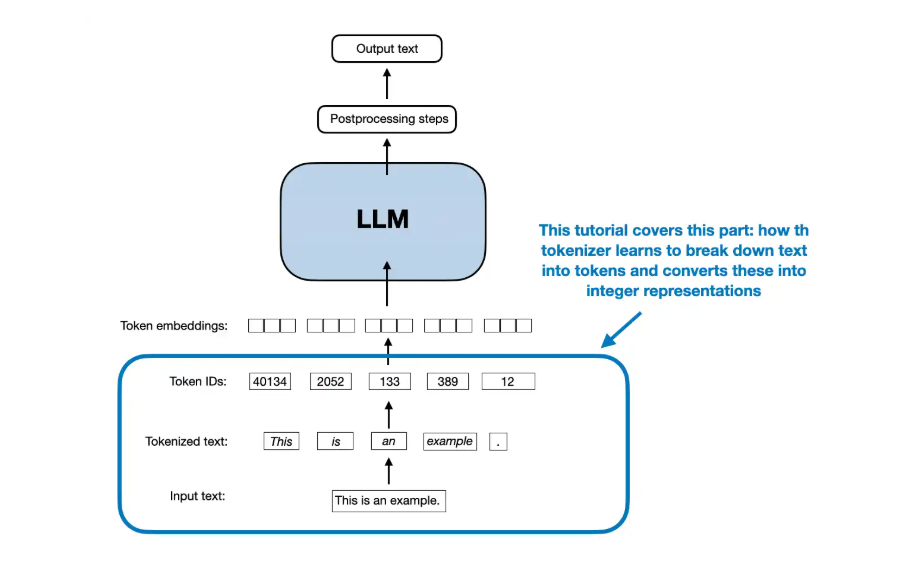

目录

- [Tokenizer 算法](#tokenizer-算法)
    - [Special Tokens](#special-tokens)
    - [Simple Tokenizer](#simple-tokenizer)
    - [BPE](#bpe)
    - [Unigram](#unigram)
- [Tokenzier 工具](#tokenzier-工具)
    - [tiktoken](#tiktoken)
    - [SentencePiecce](#sentencepiecce)
- [资料](#资料)

# Tokenizer 算法

## Special Tokens

* `[BOS]` (beginning of sequence) marks the beginning of text
* `[EOS]` (end of sequence) marks where the text ends (this is usually used to concatenate multiple 
  unrelated texts, e.g., two different Wikipedia articles or two different books, and so on)
* `[PAD]` (padding) if we train LLMs with a batch size greater than 1 (we may include multiple texts 
  with different lengths; with the padding token we pad the shorter texts to the longest length so 
  that all texts have an equal length)
* `[UNK]` to represent words that are not included in the vocabulary
    - GPT-2 does not use an `[UNK]` token for out-of-vocabulary words; instead, 
      GPT-2 uses a byte-pair encoding (BPE) tokenizer
* `<|endoftext|>` is analogous to the `[EOS]`
    - Note that GPT-2 does not need any of these tokens mentioned above but only uses 
      an `<|endoftext|>` token to reduce complexity
    - GPT also uses the <|endoftext|> for padding (since we typically use a mask when 
      training on batched inputs, we would not attend padded tokens anyways, 
      so it does not matter what these tokens are)

## Simple Tokenizer

* `layers.tokenizer.simple_custom.SimpleTokenizer`

## BPE

> Byte-Pair Encoding, BPE

BPE 算法最初于 1994 年描述："一种新的数据压缩算法"由 Philip Gage 撰写。
如今大多数项目，包括 Llama 3，都使用 OpenAI 的开源 `tiktoken` 库，因其计算性能优越；
它允许加载预训练的 GPT-2 和 GPT-4 分词器，例如（Llama 3 模型也是使用 GPT-4 分词器进行训练的）。

BPE 的主要思想是将文本转换为整数表示（token IDs），用于 LLM 训练。

## Unigram

# Tokenzier 工具

## tiktoken

## SentencePiecce

# 资料

* [如何实现一个分词器](https://juejin.cn/post/7397701403378155530)
* BPE
    - [A New Algorithm for Data Compression](http://www.pennelynn.com/Documents/CUJ/HTML/94HTML/19940045.HTM)
    - https://github.com/openai/gpt-2/blob/master/src/encoder.py
    - https://github.com/rasbt/LLMs-from-scratch/blob/0911e71497769782975d68dba6e13f22157e5fb5/ch02/02_bonus_bytepair-encoder/compare-bpe-tiktoken.ipynb
    - https://github.com/rasbt/LLMs-from-scratch/blob/2dc46bedc6e86b79a16c4099e557564cd23e03ef/ch02/05_bpe-from-scratch/bpe-from-scratch.ipynb
    - https://github.com/rasbt/LLMs-from-scratch/blob/2dc46bedc6e86b79a16c4099e557564cd23e03ef/ch02/02_bonus_bytepair-encoder/bpe_openai_gpt2.py
